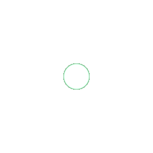
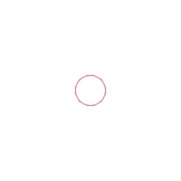
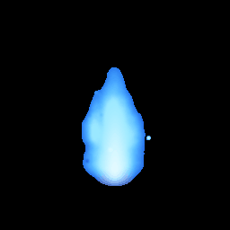
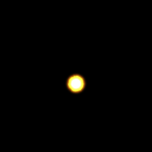
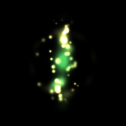
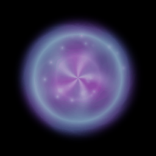
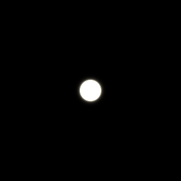
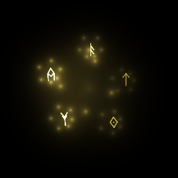
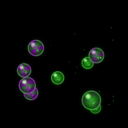

# AutoFX

AI-powered visual effects animation generator for games. Describe an effect in plain English and get a transparent GIF animation.

## Examples

| Command | Output |
|---------|--------|
| `autofx "fiery explosion" -f 30 -o explosion.gif` |  |
| `autofx "mystical purple flames" --loop -d 1.5 -f 45 -o magic-flames.gif` |  |
| `autofx "glowing energy ball" --loop -f 30 -o energy-ball.gif` |  |
| `autofx "healing aura with rising particles" --loop -f 60 -o heal.gif` |  |

## How It Works

1. You describe a visual effect (e.g., "fiery explosion")
2. Claude generates a Shadertoy-style GLSL shader
3. The shader is rendered frame-by-frame using ModernGL
4. Output is saved as a transparent GIF (perfect for game sprites)

The Claude agent has access to tools that let it compile, test, and preview shaders before producing the final animation.

## Installation

### macOS

```bash
git clone https://github.com/Poita/autofx.git
cd autofx
pip install -e .
export ANTHROPIC_API_KEY=sk-ant-...
```

ModernGL ships prebuilt wheels for macOS, so no system packages needed beyond a working OpenGL (already present on every Mac).

### Linux (headless servers, Docker, etc.)

ModernGL doesn't have prebuilt aarch64 wheels and its `glcontext` extension compiles against several display backends, so a Linux install needs both the build toolchain and runtime + dev libraries for X11/EGL/GL/GLES, even if you're rendering headless.

On Debian / Ubuntu (and its derivatives):

```bash
# Build deps for moderngl's C++ extension
sudo apt install -y g++ python3-dev libx11-dev libgl1-mesa-dev libegl1-mesa-dev libgles2-mesa-dev

# Runtime libs (libosmesa / Mesa software rendering for headless boxes)
sudo apt install -y libegl1 libegl-mesa0 libgl1 libglx-mesa0 libgles2

# Then install autofx
git clone https://github.com/Poita/autofx.git
cd autofx
pip install -e .
export ANTHROPIC_API_KEY=sk-ant-...

# Headless rendering hints (no display, no GPU)
export LIBGL_ALWAYS_SOFTWARE=1
export EGL_PLATFORM=surfaceless
```

### Linux (desktop, with a real GPU + display)

Same as the headless instructions but without the `LIBGL_ALWAYS_SOFTWARE` / `EGL_PLATFORM` overrides — your driver handles it.

### Anthropic API key

`autofx` uses the Claude API to generate shaders, so you need an `ANTHROPIC_API_KEY`. Get one from <https://console.anthropic.com/>. Set it before running:

```bash
export ANTHROPIC_API_KEY=sk-ant-...
```

## CLI Usage

```bash
# Basic usage (one-shot effect that dissipates by end)
autofx "fiery explosion" -o explosion.gif

# Looping effect (seamless loop)
autofx "magical flames" --loop -d 2.0 -o flames.gif

# With custom settings
autofx "magic sparkles" --duration 2.0 --resolution 128x128 --frames 20 -o sparkles.gif

# High-quality with more frames
autofx "lightning bolt" -d 1.0 -r 256x256 -f 60 -o lightning.gif

# With PNG sprite sheet (auto grid layout)
autofx "energy ball" -f 16 -s -o energy.gif

# Sprite sheet with specific row count
autofx "coin spin" --loop -f 8 -s --rows 1 -o coin.gif

# Multiple variations with different seeds
autofx "particle burst" -n 3 -o burst.gif
# Output: burst-0.gif, burst-1.gif, burst-2.gif, burst.glsl

# Re-render existing shader at different settings
autofx explosion.glsl -r 512x512 -f 60 -o explosion_hd.gif

# Generate sprite sheet from existing shader
autofx explosion.glsl -s -f 16 -o explosion.gif

# Edit an existing shader with AI
autofx --edit magic-flames.glsl "make the flames blue instead" --loop -d 1.5 -f 45 -o blue-flames.gif
```

### Options

| Option | Short | Default | Description |
|--------|-------|---------|-------------|
| `prompt` | | (required) | Effect description, or `.glsl` file to render |
| `--duration` | `-d` | 1.0 | Animation duration in seconds |
| `--resolution` | `-r` | 256x256 | Output resolution (WxH) |
| `--frames` | `-f` | 10 | Number of frames |
| `--output` | `-o` | output.gif | Output file path |
| `--loop` | `-l` | false | Seamlessly looping effect |
| `--spritesheet` | `-s` | false | Also output a PNG sprite sheet |
| `--rows` | | auto | Rows in sprite sheet |
| `--variations` | `-n` | 1 | Generate N variations with different seeds |
| `--model` | `-m` | opus | Model to use for generation |
| `--edit` | `-e` | | Edit existing `.glsl` file (prompt becomes modification) |
| `--verbose` | `-v` | false | Print detailed progress |

### Variations Example

Generate multiple unique variations from the same prompt using `-n`:

```bash
autofx "colorful particle explosion with sparks flying in random directions" -n 3 -f 30 -o particle-burst.gif
```

| Variation 0 | Variation 1 | Variation 2 |
|-------------|-------------|-------------|
|  |  |  |

Each variation uses a different random seed while sharing the same shader code.

### Edit Example

Modify an existing shader with `--edit`:

```bash
autofx --edit examples/magic-flames.glsl "make the flames blue instead of purple" --loop -d 1.5 -f 45 -o blue-flames.gif
```

| Original | Edited |
|----------|--------|
|  |  |

The AI modifies the shader's color palette while preserving the flame animation structure.

## Library Usage

### High-Level API (with Claude Agent)

```python
import asyncio
from autofx import generate_vfx

async def main():
    result = await generate_vfx(
        prompt="fiery explosion",
        duration=1.0,
        resolution=(256, 256),
        frames=10,
        output_path="explosion.gif"
    )

    if result["success"]:
        print(f"GIF saved to: {result['gif_path']}")
        print(f"Shader saved to: {result['shader_path']}")
    else:
        print(f"Failed: {result['error']}")

asyncio.run(main())
```

### Low-Level API (Direct Shader Rendering)

If you already have shader code, you can render it directly:

```python
from autofx import render_shader, save_gif

shader_code = '''
void mainImage(out vec4 fragColor, in vec2 fragCoord) {
    vec2 uv = fragCoord / iResolution.xy;
    vec2 center = vec2(0.5);
    float dist = length(uv - center);

    // Animated circle
    float radius = 0.3 + 0.1 * sin(iTime * 3.0);
    float circle = smoothstep(radius + 0.02, radius - 0.02, dist);

    // Color
    vec3 color = vec3(1.0, 0.5, 0.0) * circle;

    fragColor = vec4(color, circle);
}
'''

# Render frames
frames = render_shader(
    shader_code=shader_code,
    duration=1.0,
    resolution=(256, 256),
    num_frames=10
)

# Save as GIF
save_gif(frames, "circle.gif", duration=1.0)
```

### Using ShaderRenderer Directly

For more control over the rendering process:

```python
from autofx import ShaderRenderer

with ShaderRenderer(256, 256) as renderer:
    # Compile once
    success, error = renderer.compile_shader(shader_code)
    if not success:
        print(f"Compile error: {error}")
    else:
        # Render individual frames
        frame_0 = renderer.render(shader_code, time=0.0)
        frame_1 = renderer.render(shader_code, time=0.5)
        frame_2 = renderer.render(shader_code, time=1.0)

        # Save frames as PNG
        frame_0.save("frame_0.png")
        frame_1.save("frame_1.png")
        frame_2.save("frame_2.png")
```

## Shader Format

AutoFX uses Shadertoy-style GLSL shaders:

```glsl
void mainImage(out vec4 fragColor, in vec2 fragCoord) {
    // fragCoord: pixel coordinates (0 to iResolution.xy)
    // fragColor: output color (RGBA)

    vec2 uv = fragCoord / iResolution.xy;  // Normalize to 0-1

    // Use iTime for animation (0 to duration)
    float t = iTime;

    // Set output color with alpha for transparency
    fragColor = vec4(color, alpha);
}
```

### Available Uniforms

| Uniform | Type | Description |
|---------|------|-------------|
| `iTime` | float | Current time in seconds (0 to duration) |
| `iResolution` | vec3 | Viewport resolution (width, height, 1.0) |
| `iSeed` | float | Random seed for variations (use with `-n`) |

### Transparency

Use the alpha channel for transparency:

```glsl
// Fully opaque pixel
fragColor = vec4(1.0, 0.0, 0.0, 1.0);

// Fully transparent pixel
fragColor = vec4(0.0, 0.0, 0.0, 0.0);

// Semi-transparent
fragColor = vec4(color, 0.5);
```

## Output Files

When you run `autofx "effect" -o effect.gif`, you get:

- `effect.gif` - Animated GIF with transparent background
- `effect.glsl` - Shader source code (includes re-render command in comments)

With `-s/--spritesheet`: also `effect.png` sprite sheet.

With `-n 3`: produces `effect-0.gif`, `effect-1.gif`, `effect-2.gif` + one `effect.glsl`.

The `.glsl` file can be re-rendered at any time: `autofx effect.glsl -r 512x512 -o effect_hd.gif`

## Requirements

- Python 3.10+
- OpenGL 3.3+ compatible graphics driver
- Anthropic API key (for Claude Agent)

## Troubleshooting

### "moderngl.Error: cannot create context"

You're missing OpenGL/EGL libraries or the headless rendering environment isn't configured. See the [Linux installation section](#linux-headless-servers-docker-etc) — install the apt packages and export `LIBGL_ALWAYS_SOFTWARE=1` and `EGL_PLATFORM=surfaceless`.

### Compile error: `glcontext/x11.cpp:5:10: fatal error: X11/Xlib.h: No such file or directory`

`moderngl`'s context module is being compiled from source and it needs X11 dev headers even in a headless build (it tries every display backend at compile time):

```bash
sudo apt install -y libx11-dev libgl1-mesa-dev libegl1-mesa-dev libgles2-mesa-dev
```

### Compile error: `aarch64-linux-gnu-g++: No such file or directory`

You're on ARM64 Linux without a C++ toolchain. ModernGL doesn't ship aarch64 wheels yet, so it compiles from source:

```bash
sudo apt install -y g++ python3-dev
```

### "claude-agent-sdk not found"

Install the Claude Agent SDK:

```bash
pip install claude-agent-sdk
```

### "ANTHROPIC_API_KEY not set"

Set your API key:

```bash
export ANTHROPIC_API_KEY=sk-ant-...
```

## Gallery

A showcase of effects generated with AutoFX:

| | | | |
|:---:|:---:|:---:|:---:|
| <br>Explosion | <br>Sparkles | <br>Lightning | <br>Energy Orb |
| <br>Smoke | <br>Ripple | <br>Torch | <br>Ice |
| <br>Heal | <br>Shock | <br>Portal | <br>Firework |
| <br>Runes | <br>Meteor | <br>Poison | <br>Shockwave |

## License

MIT
