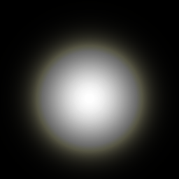
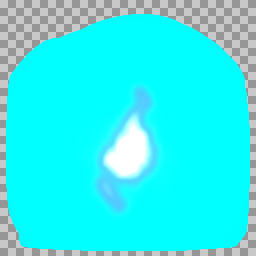
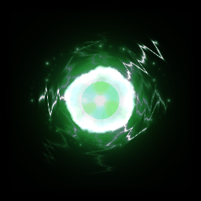
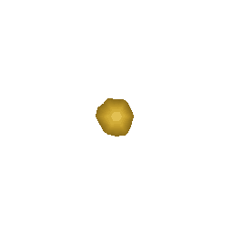

# AutoFX

AI-powered visual effects animation generator for games. Describe an effect in plain English and get a transparent GIF animation.

## Examples

| Command | Output |
|---------|--------|
| `autofx "fiery explosion" -f 30 -o explosion.gif` |  |
| `autofx "mystical purple flames" --loop -d 1.5 -f 45 -o magic-flames.gif` |  |
| `autofx "glowing energy ball" --loop -f 30 -o energy-ball.gif` |  |
| `autofx "healing aura with rising particles" --loop -f 60 -o heal.gif` |  |

## How It Works

1. You describe a visual effect (e.g., "fiery explosion")
2. Claude generates a Shadertoy-style GLSL shader
3. The shader is rendered frame-by-frame using ModernGL
4. Output is saved as a transparent GIF (perfect for game sprites)

The Claude agent has access to tools that let it compile, test, and preview shaders before producing the final animation.

## Installation

```bash
# Clone or download this repository
cd autofx

# Install the package
pip install -e .

# Or install dependencies directly
pip install claude-agent-sdk moderngl pillow numpy
```

You'll also need to set your Anthropic API key:

```bash
export ANTHROPIC_API_KEY=your-api-key
```

## CLI Usage

```bash
# Basic usage (one-shot effect that dissipates by end)
autofx "fiery explosion" -o explosion.gif

# Looping effect (seamless loop)
autofx "magical flames" --loop -d 2.0 -o flames.gif

# With custom settings
autofx "magic sparkles" --duration 2.0 --resolution 128x128 --frames 20 -o sparkles.gif

# High-quality with more frames
autofx "lightning bolt" -d 1.0 -r 256x256 -f 60 -o lightning.gif

# With PNG sprite sheet (auto grid layout)
autofx "energy ball" -f 16 -s -o energy.gif

# Sprite sheet with specific row count
autofx "coin spin" --loop -f 8 -s --rows 1 -o coin.gif

# Multiple variations with different seeds
autofx "particle burst" -n 3 -o burst.gif
# Output: burst-0.gif, burst-1.gif, burst-2.gif, burst.glsl

# Re-render existing shader at different settings
autofx explosion.glsl -r 512x512 -f 60 -o explosion_hd.gif

# Generate sprite sheet from existing shader
autofx explosion.glsl -s -f 16 -o explosion.gif
```

### Options

| Option | Short | Default | Description |
|--------|-------|---------|-------------|
| `prompt` | | (required) | Effect description, or `.glsl` file to render |
| `--duration` | `-d` | 1.0 | Animation duration in seconds |
| `--resolution` | `-r` | 256x256 | Output resolution (WxH) |
| `--frames` | `-f` | 10 | Number of frames |
| `--output` | `-o` | output.gif | Output file path |
| `--loop` | `-l` | false | Seamlessly looping effect |
| `--spritesheet` | `-s` | false | Also output a PNG sprite sheet |
| `--rows` | | auto | Rows in sprite sheet |
| `--variations` | `-n` | 1 | Generate N variations with different seeds |
| `--model` | `-m` | opus | Model to use for generation |
| `--verbose` | `-v` | false | Print detailed progress |

## Library Usage

### High-Level API (with Claude Agent)

```python
import asyncio
from autofx import generate_vfx

async def main():
    result = await generate_vfx(
        prompt="fiery explosion",
        duration=1.0,
        resolution=(256, 256),
        frames=10,
        output_path="explosion.gif"
    )

    if result["success"]:
        print(f"GIF saved to: {result['gif_path']}")
        print(f"Shader saved to: {result['shader_path']}")
    else:
        print(f"Failed: {result['error']}")

asyncio.run(main())
```

### Low-Level API (Direct Shader Rendering)

If you already have shader code, you can render it directly:

```python
from autofx import render_shader, save_gif

shader_code = '''
void mainImage(out vec4 fragColor, in vec2 fragCoord) {
    vec2 uv = fragCoord / iResolution.xy;
    vec2 center = vec2(0.5);
    float dist = length(uv - center);

    // Animated circle
    float radius = 0.3 + 0.1 * sin(iTime * 3.0);
    float circle = smoothstep(radius + 0.02, radius - 0.02, dist);

    // Color
    vec3 color = vec3(1.0, 0.5, 0.0) * circle;

    fragColor = vec4(color, circle);
}
'''

# Render frames
frames = render_shader(
    shader_code=shader_code,
    duration=1.0,
    resolution=(256, 256),
    num_frames=10
)

# Save as GIF
save_gif(frames, "circle.gif", duration=1.0)
```

### Using ShaderRenderer Directly

For more control over the rendering process:

```python
from autofx import ShaderRenderer

with ShaderRenderer(256, 256) as renderer:
    # Compile once
    success, error = renderer.compile_shader(shader_code)
    if not success:
        print(f"Compile error: {error}")
    else:
        # Render individual frames
        frame_0 = renderer.render(shader_code, time=0.0)
        frame_1 = renderer.render(shader_code, time=0.5)
        frame_2 = renderer.render(shader_code, time=1.0)

        # Save frames as PNG
        frame_0.save("frame_0.png")
        frame_1.save("frame_1.png")
        frame_2.save("frame_2.png")
```

## Shader Format

AutoFX uses Shadertoy-style GLSL shaders:

```glsl
void mainImage(out vec4 fragColor, in vec2 fragCoord) {
    // fragCoord: pixel coordinates (0 to iResolution.xy)
    // fragColor: output color (RGBA)

    vec2 uv = fragCoord / iResolution.xy;  // Normalize to 0-1

    // Use iTime for animation (0 to duration)
    float t = iTime;

    // Set output color with alpha for transparency
    fragColor = vec4(color, alpha);
}
```

### Available Uniforms

| Uniform | Type | Description |
|---------|------|-------------|
| `iTime` | float | Current time in seconds (0 to duration) |
| `iResolution` | vec3 | Viewport resolution (width, height, 1.0) |
| `iSeed` | float | Random seed for variations (use with `-n`) |

### Transparency

Use the alpha channel for transparency:

```glsl
// Fully opaque pixel
fragColor = vec4(1.0, 0.0, 0.0, 1.0);

// Fully transparent pixel
fragColor = vec4(0.0, 0.0, 0.0, 0.0);

// Semi-transparent
fragColor = vec4(color, 0.5);
```

## Output Files

When you run `autofx "effect" -o effect.gif`, you get:

- `effect.gif` - Animated GIF with transparent background
- `effect.glsl` - Shader source code (includes re-render command in comments)

With `-s/--spritesheet`: also `effect.png` sprite sheet.

With `-n 3`: produces `effect-0.gif`, `effect-1.gif`, `effect-2.gif` + one `effect.glsl`.

The `.glsl` file can be re-rendered at any time: `autofx effect.glsl -r 512x512 -o effect_hd.gif`

## Requirements

- Python 3.10+
- OpenGL 3.3+ compatible graphics driver
- Anthropic API key (for Claude Agent)

## Troubleshooting

### "moderngl.Error: cannot create context"

Make sure you have a working OpenGL driver. On headless servers, you may need to install OSMesa:

```bash
# Ubuntu/Debian
sudo apt-get install libosmesa6-dev

# Then set environment variable
export PYOPENGL_PLATFORM=osmesa
```

### "claude-agent-sdk not found"

Install the Claude Agent SDK:

```bash
pip install claude-agent-sdk
```

### "ANTHROPIC_API_KEY not set"

Set your API key:

```bash
export ANTHROPIC_API_KEY=sk-ant-...
```

## License

MIT
